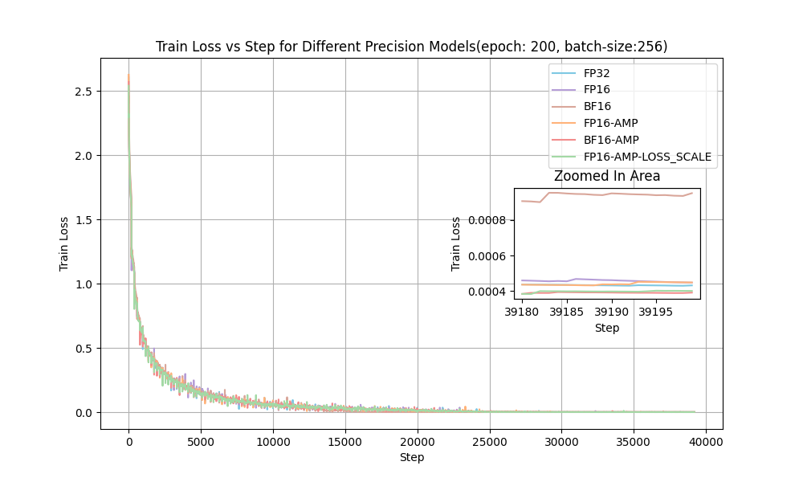
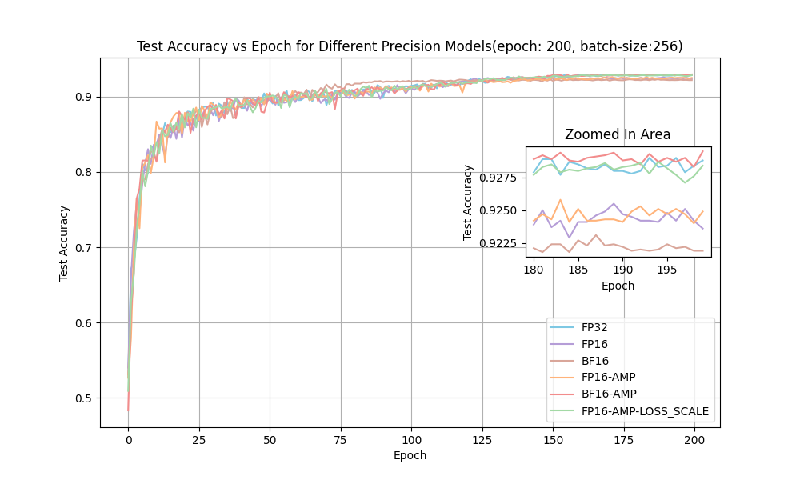
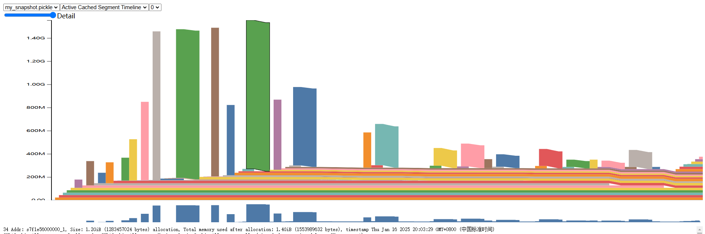

`Authored by 吴子昂, if you have any questions please contact me by ziangwu@stu.pku.edu.cn`
## Introduction
该部分代码主要是用于CNN类模型在CIFAR-10数据集上进行AMP混精的训练表现。整体代码结构如下：
```bash
.
├── Cifar10-VGG19-e200-b256-test_acc.png
├── Cifar10-VGG19-e200-b256-train_loss.png
├── data
├── demo.ipynb
├── main.py
├── mem_fp32.png
├── models
├── README.md
├── requirements.txt
├── utils.py
├── vgg_train
├── visualize
└── wandb
```
其中:
- checkpoint 用于放置训练产生的模型权重文件。
- data 是放置数据集的位置，可以提前准备好cifar，或者在main.py中开启cifar的自动下载。
- main.py 是主要的训练文件，在该文件中完成训练和测试。
- models 维护了所有可用的CNN模型，本项目中使用的是VGG-19。
- results 用于存储实验中间产生的一些日志文件。
- utils.py 维护了训练时进度条，在批量实验时，由于会将结果输出到log中，与进度条输出会有冲突，因此这一文件实际在批量测试中可以忽略。
- vgg_train 文件夹放置了所写的训练脚本，之所以每种精度的模型分开写是为了方便在多卡上并行测试提升速度。
- visualization 文件主要维护了可视化的文件，用于处理生成的日志文件并绘制test和train过程中的loss和accuracy曲线图、显存占用图等。
对应的文件
⚡ 本项目提供了所有实验过程中产生的权重文件（不同batch-size不同精度）以及训练过程中产生的log文件，可以在网盘上下载以进行快速的可视化，当然也可以运行demo.ipynb脚本可视化你自己的训练⚡
- 训练过程中产生的log文件（用于绘制loss和acc）链接: https://pan.baidu.com/s/1bavVdTCP-BzFcTrkJOm0Iw?pwd=mfdz 提取码: mfdz 
- 训练过程中各精度各batch大小的权重文件 链接: https://pan.baidu.com/s/1-MmNhlzux4detnhHZ2Iwrg?pwd=hvnx 提取码: hvnx
## Env setup
```bash
conda create -n MTPCifar10 python=3.9 -y
conda activate MTPCifar10
pip install requirements.txt
```
## Training
⚠️⚠️注意⚠️⚠️如果显卡不是Ampere系列请避免指定dtype为bf16！
以下是一些运行实例，你可以通过这些例子快速上手：
```bash
# Start training with script: 
# eg. fp16-amp-scale
bash vgg_train/train_fp16_amp_scale.sh
```
```bash
# You can manually train with options: 
# eg. train resnet-18 with bf16-amp-scale for 200 epochs/256 per batch/0.01 lr and turn on wandb and progress-bar
export CIDA_VISIBLE_DEVICES=0
export WANDB_API_KEY="" # set it if you want to log to your wandb
python main.py \
 --model ResNet18 \
 --lr 0.01 \
 --batch-size 256 \
 --epochs 200 \
 --wandb \
 --progress-bar \
 --dtype bf16 \
 --amp \
 --loss-scale
```
关于option的含义：
| 参数          | 描述                                      |
| ------------- | ----------------------------------------- |
| `--model`     | 选择使用的模型架构，例：ResNet18。        |
| `--lr`        | 学习率，例：0.01。                        |
| `--batch-size`| 每批次处理的数据量，例：256。             |
| `--epochs`    | 训练的轮数，例：200。                     |
| `--wandb`     | 启用WandB（Weights & Biases）进行实验记录和可视化。 |
| `--progress-bar`| 显示训练进度条。                         |
| `--dtype`     | 数据类型，例：bf16（bfloat16）。         |
| `--amp`       | 启用自动混合精度（Automatic Mixed Precision）。 |
| `--loss-scale`| 启用损失缩放，用于混合精度训练。          |
## Visualization
## 可视化train loss 和 test accuracy
```bash
# 可以根据batch以及模型等信息改变run脚本，但是注意，前题是这些信息要和main中传递的完全一致，py文件才能正确找到对应的log文件
cd visualize
bash run.sh
```
能够得到类似下面两张图中的结果



## 可视化average memory
这个部分实验是直接运行main.py然后观察稳定后显存得到的，故已经将观测值写入列表，具体可以根据自己的观测来调整，然后运行如下指令
```bash
cd visualize
cd vis_mem
python visualize.py
```
## 可视化分析单个前反向传播训练过程的GPU memory allocate的情况
这部分主要参考的是torch的cuda memory分析 https://pytorch.org/docs/stable/torch_cuda_memory.html 。在demo.ipynb中进行了展示，这里只简要介绍一下思路：
```python
# enable memory history, which will
# add tracebacks and event history to snapshots
torch.cuda.memory._record_memory_history()

run_your_code()
torch.cuda.memory._dump_snapshot("my_snapshot.pickle")
```
得到pickle文件之后，可访问https://pytorch.org/memory_viz对内存进行可视化分析，可以得到类似于下图：

## 可视化时间
这里对时间上的处理比较简单，直接测量了从开始训练到结束训练的总时长，实际其中还包括了每个epoch训练后的test时间，但是由于是公平对比，可以粗略的作为训练速度的参考。时间是直接被log在results的.log文件中的，可以在网盘中看到。
## demo 
可以直接在demo.ipynb中一键运行，但注意，该demo仅设定了一个训练，可视化时只显示一条曲线
## Thanks to🤗
本工作是在 https://github.com/kuangliu/pytorch-cifar.git 的基础上进行改进而来的，感谢该工作的贡献，使得整个实验过程比较顺利，能够较为高效地完成不同精度的性能对比测试。
## Appendix
`本项目完整代码也开源在了github上，项目地址是：https://github.com/ZiangWu-77/CIFAR-10-MTP/tree/main，若文件有缺失可能是被误删或者遗漏了，在github上能找到完整的版本。`
